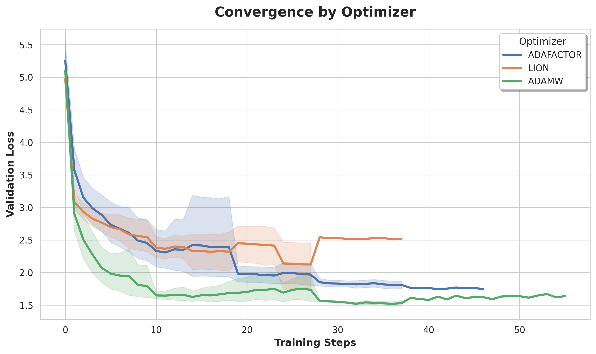
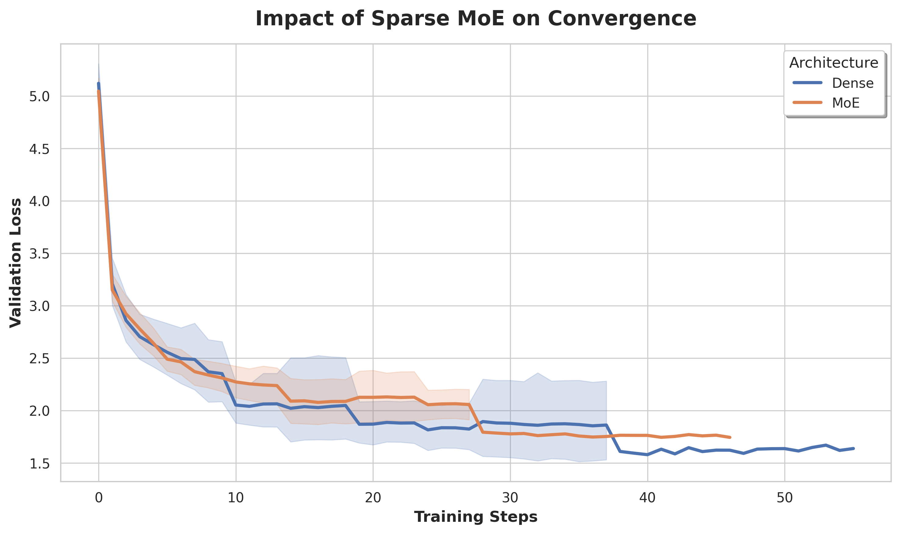
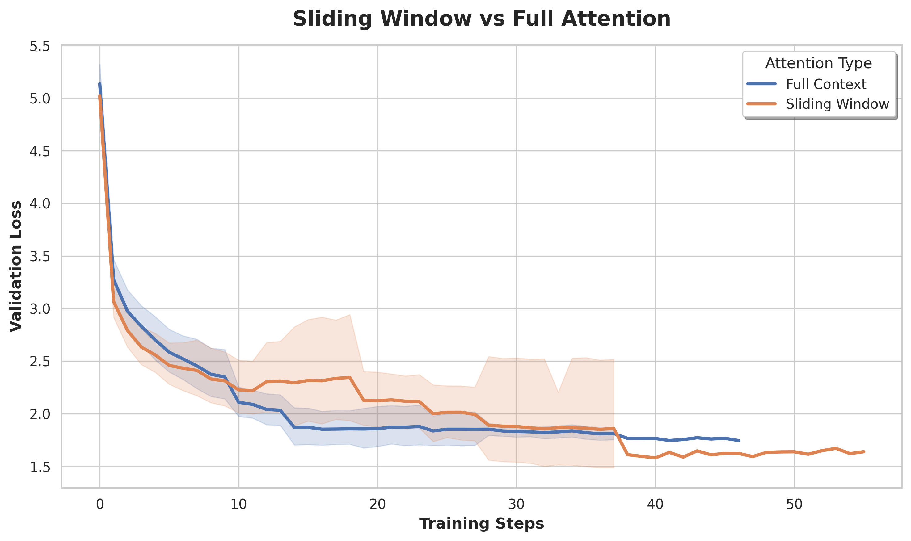
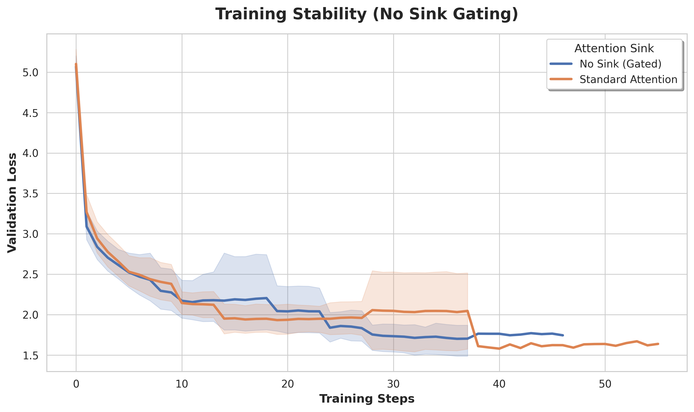
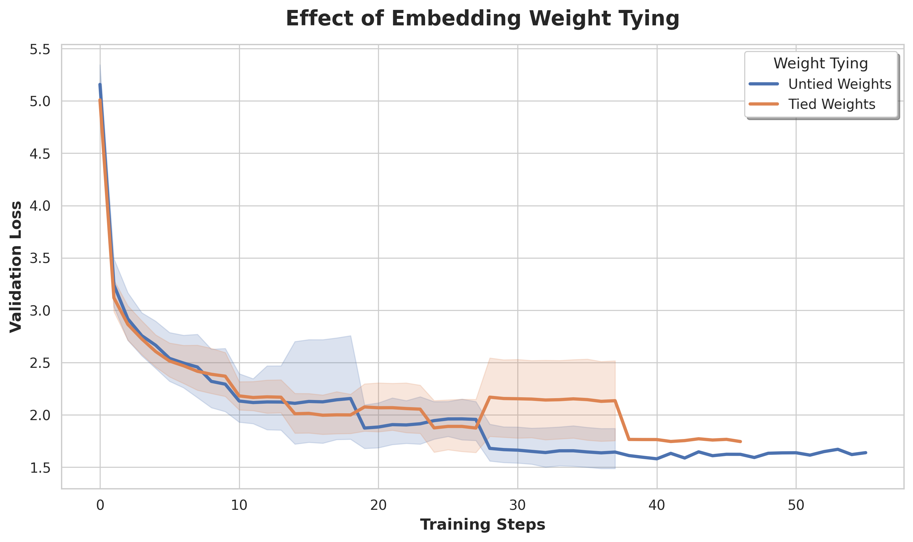
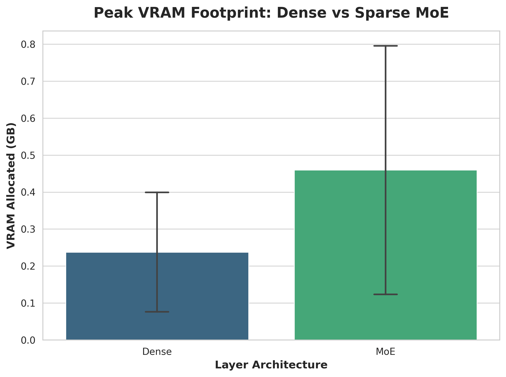

<div align="center">

# 𝔇𝔞𝔫𝔱𝔦𝔫𝔬𝔛

<i>"Ah JAX, vituperio delle genti..."</i>  
<b>(Ah JAX, the shame of the people...)</b>

<br>

A Transformer so **"nano" it barely rhymes**, implemented in **JAX** and **Flax NNX**. Built with **sweat** and **XLA errors**.


<br>

[](https://github.com/google/jax)
[](https://github.com/google/flax)
[](https://www.python.org/)
[](https://opensource.org/licenses/MIT)

</div>

<br>

<p align="center">
  
</p>

------------------------------------------------------------------------

# Overview: The DantinoX Project

> *"Nel mezzo del cammin di nostra vita mi ritrovai per una selva oscura, ché la diritta via era smarrita."*

**DantinoX** is a from-scratch implementation of a modern Large Language Model built natively in **JAX and Flax NNX**. The primary motivation behind this project is educational and exploratory: to understand the internal mechanics of current transformer architectures and to learn how to write efficient JAX code without constantly fighting XLA compilation errors.

To thoroughly understand these constraints, DantinoX implements standard modern Deep Learning components directly from the ground up:

* **Sparse Mixture of Experts (MoE)** with **Load Balancing Loss**
* **Rotary Positional Embeddings (RoPE)**
* **Grouped Query Attention (GQA)**
* **Sliding Window & Attention Gating**
* **Static KV Cache**
* **Weight Tying**
* **Gradient Checkpointing and Gradient Accumulation**


### Highly Customizable

Rather than a rigid production artifact, the codebase is designed to be **highly customizable**. The architecture is modular, allowing users to easily toggle between different configurations—such as switching between a standard Dense MLP and Sparse MoE routing—to observe the direct impact on compute requirements and VRAM usage.

The final result is a functional, memory-efficient Transformer. It serves as a practical reference for resolving shape mismatches, managing GPU memory footprint, and successfully taming the XLA compiler.

> *"E quindi uscimmo a riveder le stelle."*

------------------------------------------------------------------------

# Project Structure


    DantinoX/
    ├── core/                   # Core neural network logic
    │   ├── config.py           # Configuration parameters (Config Dataclass)
    │   ├── model.py            # Transformer architecture (Attention, MLP, MoE, Block)
    │   ├── generation.py       # Inference engine & static KV-Cache management
    │   └── __init__.py
    │
    ├── configs/                # YAML configuration files
    │   ├── default_config.yaml # Standard training setup
    │   └── sweep.yaml          # Hyperparameter search config (W&B)
    │
    ├── utils/                  # Utility functions
    │   ├── tokenizer.py        # Tokenizer management (Char-level & Byte-Level BPE)
    │   ├── helpers.py          # Loss functions, batching, sharding logic
    │   └── __init__.py
    │
    ├── runs/                   # Training outputs (weights, logs, saved configs)
    │
    ├── analyze_dataset.py      # Dataset statistical analysis
    ├── train.py                # Training script
    ├── generate.py             # Text generation script
    ├── requirements.txt        # Python dependencies
    └── README.md               # Documentation

## Architecture & Technical Specs


| Feature | Implementation Details |
| :--- | :--- |
| **Attention** | Causal Self-Attention with GQA and optional Sliding Window and gating `no_sink`|
| **Feed-Forward** | Configurable: Dense MLP or Sparse MoE (Top-K Routing) |
| **Positioning** | Rotary Positional Embeddings (RoPE) or Absolute |
| **Memory Opt.** | Gradient checkpointing (`nnx.remat`) & Weight Tying (`lm_head.kernel = wte.embedding.T`)|
| **Inference Opt.**| Autoregressive generation with Static KV-Cache |
| **Regularization**| Attention, residual, and embedding dropout; auxiliary MoE balancing loss `load_balancing_loss` |
| **Distributed** | JAX SPMD (Data / Model / FSDP) - *Future Work* |


## Configuration Reference

DantinoX is entirely driven by a centralized YAML configuration. This design allows you to easily ablate architectural components (like toggling MoE or sliding window attention) without modifying the core JAX codebase.

Below is the annotated `default_config.yaml`:

```yaml
model:
  dim: 512                    # Core hidden dimension
  n_heads: 16                 # Number of query heads
  kv_heads: 4                 # Number of key/value heads (set < n_heads for GQA)
  head_size: 32               # Dimensionality of each attention head
  num_blocks: 12              # Number of transformer layers
  max_context: 512            # Maximum sequence length
  weight_tying: true          # Share weights between embedding and LM head
  activation: gelu            # Non-linear activation function
  gradient_checkpointing: true # Enable nnx.remat to reduce VRAM usage
  dropout_rate: 0.15          # Regularization dropout probability

moe:
  use_moe: true               # Toggle Sparse MoE vs standard Dense FFN
  n_experts: 4                # Total number of routed experts
  top_k_mlp: 2                # Number of experts activated per token
  expansion: 4                # Hidden dimension expansion factor in experts
  alpha_balance: 0.1          # Weight of the auxiliary load-balancing loss

attention:
  use_rotary_pos: true        # Enable Rotary Positional Embeddings (RoPE)
  trainable_pos: false        # Enable standard learned positional embeddings
  absolute_pos: false         # Enable absolute sinusoidal embeddings
  sliding_window: true        # Restrict attention to a local past context
  context_window: 64          # Size of the local window (if sliding_window: true)
  no_sink: true               # Enable attention gating to stabilize training

tokenizer:
  tokenizer_type: "char"      # Tokenization strategy (e.g., character-level, BPE)
  vocab_size: 2000            # Maximum vocabulary size
  tokenizer_path: "configs/vocab.json" # Path to save/load vocabulary mapping

data:
  dataset_source: "huggingface" # Source platform for the training corpus
  dataset_name: "Daniele/dante-corpus" # Dataset identifier
  streaming: true             # Stream data to bypass local RAM constraints

training:
  lr: 0.0015                  # Peak learning rate
  batch_size: 64              # Global batch size
  grad_accum: 4               # Gradient accumulation steps for large effective batches
  seed: 42                    # RNG seed for reproducibility
  optimizer: "adamw"          # Optimizer algorithm
  epochs: 100                 # Total training epochs
  warmup_steps: 0             # Number of steps for learning rate warmup

generation:
  use_cache: true             # Enable static KV cache for fast autoregressive decoding
  top_p: null                 # Nucleus sampling threshold (null to disable)
  top_k: null                 # Top-k sampling threshold (null to disable)
  seed: 42                    # RNG seed for generation sampling
  greedy: false               # Toggle greedy decoding vs stochastic sampling
  max_generations: 150        # Maximum number of tokens to generate
  temperature: 1.3            # Sampling temperature (higher = more random)

logging:
  eval_iters: 20              # Frequency of evaluation and metric logging
  log_file: "training_log.csv" # Path for training metrics output
  summary_file: "model_summary.json" # Path to dump architecture parameter summary
```
---


## Quickstart & Installation

```bash
git clone https://github.com/winstonsmith1897/DantinoX.git
cd DantinoX

# 1. Create and activate environment (Conda recommended)
conda create -n dantinox python=3.12 -y
conda activate dantinox

# 2. Install JAX with NVIDIA GPU support, then project dependencies
pip install -U "jax[cuda12]"
pip install -r requirements.txt
```

*(Note: For standard `venv`, use `python -m venv venv && source venv/bin/activate` instead).*

---

## Training Pipeline

The training loop leverages Flax NNX functional state management. The core update step uses `@jax.jit`  to fuse the forward pass, loss computation, and optimizer updates into a single, highly optimized **XLA kernel**. There is also the "not splitted version", which uses `@nnx.jit`. However, as per flax documentation (https://flax.readthedocs.io/en/stable/guides/performance.html), the one with `@jax.jit` is faster for smaller model/batch size.

### Execution

```bash
# Run using the default configuration file
python train.py --config configs/default_config.yaml

# Dynamically override parameters via CLI
python train.py --batch_size 64 --lr 5e-4 --use_moe True
```

---

## Monitoring & Logging

Every execution generates an isolated artifact directory (`runs/run_YYYYMMDD_HHMMSS/`) containing the state of the experiment: `config.yaml`, `model_summary.json`, `training_log.csv`, and the serialized `model_weights.msgpack`.

**Live Console Output:**

```text
Step   50/4200 | Train: 4.1204 (Bal: 0.0452) | Val: 4.1560 (Bal: 0.0461) | VRAM: 3.42GB
Step  100/4200 | Train: 3.8901 (Bal: 0.0421) | Val: 3.9102 (Bal: 0.0415) | VRAM: 3.42GB
```

**Tracked Metrics:**

| Metric | Description |
| :--- | :--- |
| **Train / Val Loss** | Cross-Entropy for autoregressive next-token prediction |
| **Balancing Loss** | Auxiliary penalty for MoE expert routing |
| **VRAM GB** | Peak device memory footprint |
| **ms_per_step** | XLA kernel execution speed and throughput |


## Hyperparameter Tuning (W&B Sweeps)

DantinoX natively supports automated hyperparameter search using **Weights & Biases (W&B)**. The search relies on a Bayesian optimization strategy designed to minimize the validation loss (`val_loss`) by efficiently exploring architectural and training configurations.

To launch a sweep, use the provided configuration.

### Sweep Configuration (`sweep.yaml`)

```yaml
program: train_sweep.py
method: bayes
metric:
  name: val_loss
  goal: minimize
parameters:
  epochs:
    values: [12, 16, 20, 24]
  optimizer:
    values: ["adamw", "adafactor", "lion"]
  tokenizer_type:
    values: ["char", "bpe"]
  max_context:
    values: [256, 512]
  weight_tying:
    values: [true, false]
  dropout_rate:
    values: [0.0, 0.1, 0.15]
  lr:
    distribution: log_uniform_values
    min: 0.0001
    max: 0.005
  batch_size:
    values: [16, 32, 64]
  grad_accum:
    values: [2, 4, 8]
  warmup_steps:
    values: [50, 100, 200]
  dim:
    values: [256, 512]
  num_blocks:
    values: [4, 8, 12]
  kv_heads:
    values: [2, 4]
  use_moe:
    values: [true, false]
  n_experts:
    values: [4]
  top_k_mlp:
    values: [1, 2]
  expansion:
    values: [2, 4]
  alpha_balance:
    distribution: uniform
    min: 0.01
    max: 0.15
  sliding_window:
    values: [true, false]
  context_window:
    values: [32, 64, 128]
  no_sink:
    values: [true, false]
  pos_encoding:
    values: ["rotary", "absolute"]
command:
  - ${env}
  - python
  - ${program}
  - ${args}
```

### Execution

Initialize the sweep and start the agent:

```bash
wandb sweep sweep.yaml
wandb agent <USERNAME/PROJECT/SWEEP_ID>
```

> ⚠️ **Technical Note on Grouped Query Attention (GQA):** > To prevent tensor shape mismatches and XLA compilation crashes during the automated search, the total number of query heads (`n_heads`) and head dimensions (`head_size`) are **dynamically calculated** inside `train_sweep.py` based on the selected `dim` and `kv_heads`. This ensures that the attention projections remain mathematically consistent across all Bayesian trials.

## Empirical Results & Ablation Studies

Through extensive hyperparameter sweeps (ID: `cacbxc69`) logged via **Weights & Biases**, we conducted a comprehensive ablation study. By isolating individual architectural choices, we evaluated their direct impact on convergence stability and memory efficiency.

### Architectural Impact on Convergence

| ⚙️ Core Optimization & Routing | 🧠 Attention Mechanisms |
| :---: | :---: |
|  |  |
| **Convergence by Optimizer:** Isolating the impact of the optimization algorithm across identical architectures. | **Sparse MoE vs Dense:** Evaluating the convergence speed when routing parameters through Top-K experts. |
|  |  |
| **Sliding Window:** Impact of restricting the attention receptive field on the learning trajectory. | **Attention Sink Gating:** Training stability achieved by applying a sigmoid gate (`no_sink`) to attention outputs. |

---

### Memory & Parameter Efficiency

| 🔗 Parameter Sharing | 💾 Memory Footprint |
| :---: | :---: |
|  |  |
| **Weight Tying:** Convergence behavior when tying the embedding matrix to the output language modeling head. | **Peak VRAM (Dense vs Sparse MoE):** Scaling capacity via MoE while maintaining a constrained VRAM footprint. |

> *Charts generated automatically from W&B Sweep telemetry using the internal plotting scripts.*

---

## Inference & Generation Engine

DantinoX implements an autoregressive generation pipeline utilizing `jax.lax.fori_loop` and `nnx.jit` to maintain execution efficiency across extended sequences.

### Technical Implementation
* **Static KV Caching:** Prevents redundant computation of previously processed tokens. The model transitions from a quadratic complexity prefill stage to a linear complexity decoding phase.
* **Decoding Strategies:**
    * **Greedy Search:** Deterministic selection of the highest-probability token.
    * **Top-K & Top-P (Nucleus) Sampling:** Stochastic sampling methods to control distribution entropy and semantic coherence.
    * **Temperature Scaling:** Adjusts the logit distribution before the softmax layer to modulate output variance.


### Usage Logic

The generation process is encapsulated in the `_generate_toks` function, which handles state management for both the initial context processing and the subsequent token generation loop:

```python
# Functional interface for sequence generation
output_ids = generate(
    model, 
    input_ids, 
    max_generations=150, 
    temperature=1.3, 
    top_p=0.9, 
    use_cache=True
)
```

> **Note on Vectorization:** The sampling logic uses `jax.vmap` to perform batch-level operations for Top-K and Top-P filtering, ensuring that probability masking and token selection do not introduce bottlenecks during the inference cycle.

---

## Running Inference

After training, you can generate text using the `generate.py` script. The script automatically loads the model configuration and weights from a specified run directory.

### Basic Usage

Generate text using the default parameters stored in the run directory:

```bash
python generate.py --run_dir runs/run_YYYYMMDD_HHMMSS --prompt "Nel mezzo del cammin "
```

### Advanced Examples

**Deterministic (Greedy) Decoding:**
Ideal for checking the model's most likely output.
```bash
python generate.py --run_dir runs/run_xxx --greedy true --max_new_tokens 100
```

**Creative Sampling (Top-P & Temperature):**
Use Nucleus sampling with a higher temperature for more varied and poetic results.
```bash
python generate.py --run_dir runs/run_xxx \
  --temperature 1.5 \
  --top_p 0.9 \
  --max_new_tokens 200
```

**Constrained Sampling (Top-K):**
Limit the vocabulary to the top 50 candidates per step.
```bash
python generate.py --run_dir runs/run_xxx --top_k 50 --temperature 1.2
```

### CLI Arguments Reference

| Argument | Type | Default | Description |
| :--- | :--- | :--- | :--- |
| `--run_dir` | `str` | **Required** | Path to the folder containing `config.yaml` and `model_weights.msgpack`. |
| `--prompt` | `str` | `"Nel mezzo..."`| Initial text to start generation. |
| `--max_new_tokens` | `int` | `150` | Maximum number of new tokens to generate. |
| `--greedy` | `bool` | `false` | If `true`, ignores sampling and picks the most likely token. |
| `--temperature` | `float` | `1.0` | Controls randomness (higher is more creative). |
| `--top_p` | `float` | `null` | Nucleus sampling threshold. |
| `--top_k` | `int` | `null` | Limits sampling to the top K most likely tokens. |
| `--use_cache` | `bool` | `true` | Toggles the static KV-cache for faster generation. |

> **Note on Performance:** The first token generation might experience a slight delay due to JIT compilation. Subsequent tokens and runs will benefit from the optimized XLA kernel, and the script will report the **tokens per second (tok/s)** throughput at the end of the run.