# Benchmarks

DantinoX ships two complementary benchmark suites that together cover the full
lifecycle of a model — from raw inference primitives on randomly-initialised
networks to end-to-end quality/throughput measurements on real trained
checkpoints.

| Suite | What it measures | Entry point |
|---|---|---|
| **Inference sweep** | Latency, throughput, KV-cache, FLOPs across 13 sweep groups and 3 attention variants (MHA / GQA / MLA) on randomly-initialised models | `make infbench` |
| **Trained-model analysis** | Decode throughput, prefill latency, measured VRAM, XLA FLOPs, and validation loss on real trained checkpoints | `make trained-bench` |

---

## Running Benchmarks

### Full inference pipeline

```bash
# Sweep + 21 plots (default)
make infbench

# Quick smoke-test (fewer warm-up / trial iterations)
python benchmarks/run_all.py --n-warmup 1 --n-trials 3

# Restrict to a subset of sweep groups
python benchmarks/run_all.py --groups attention_type scale batch_size

# Re-plot from an existing CSV without re-running the sweep
python benchmarks/run_all.py --plot-only

# Via the CLI
dantinox infbench --groups scale --n-trials 5 --device 1
```

### Trained-model pipeline

```bash
# Run analysis + batch sweep on checkpoints in runs/
make trained-bench

# Both pipelines in one command
python benchmarks/run_all.py --trained

# Trained pipeline only (skip inference sweep)
python benchmarks/run_all.py --trained --inference-off

# Via the CLI
dantinox infbench --trained --runs-dir runs/
```

### Pipeline stages

```
Stage 1  benchmarks/inference_sweep.py    →  results/inference_sweep.csv
Stage 2  benchmarks/plot_inference.py     →  results/plots/*.png   (21 figures)
Stage 3  benchmarks/trained_analysis.py   →  results/benchmark_results.csv
Stage 4  benchmarks/trained_batch_sweep.py→  results/batch_sweep_results.csv
```

Each stage runs in its own subprocess so JAX state and compiled functions
never conflict between stages. Stages 3–4 only execute when `--trained` is
passed.

---

## Inference Sweep

Systematic performance comparison of **MHA**, **GQA**, and **MLA** attention
variants across 13 orthogonal sweep groups. All models are randomly initialised
— results are pure infrastructure benchmarks, independent of training quality.

Figures are produced by `benchmarks/plot_inference.py`. Each panel shows the
three attention variants as grouped bars (or scatter points) so crossover
effects are immediately visible.

### Attention Type

Overall latency and throughput comparison across the three attention families at
fixed model size. MLA's extra projection steps (`W_DKV`, `W_UV`, `W_UK`)
produce higher prefill latency but a proportionally smaller KV cache.

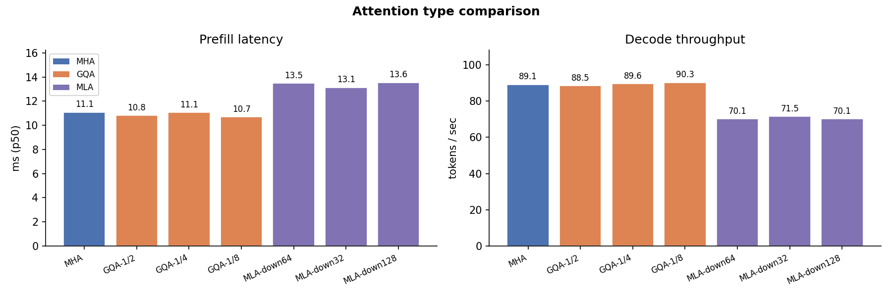

### Scale

Prefill latency and decode throughput as model dimension (`dim`) and depth
(`num_blocks`) scale from small to large. MLA latency grows faster than MHA/GQA
because its low-rank projections add compute that is not amortised across heads.

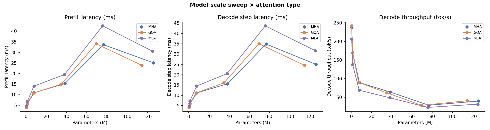

### Batch Size

Throughput (tok/s) at batch sizes 1 → 32. At small batch sizes all three
variants are weight-bandwidth-bound and behave similarly. At large batches the
KV-cache bottleneck surfaces: MLA's compact cache keeps VRAM pressure lower.

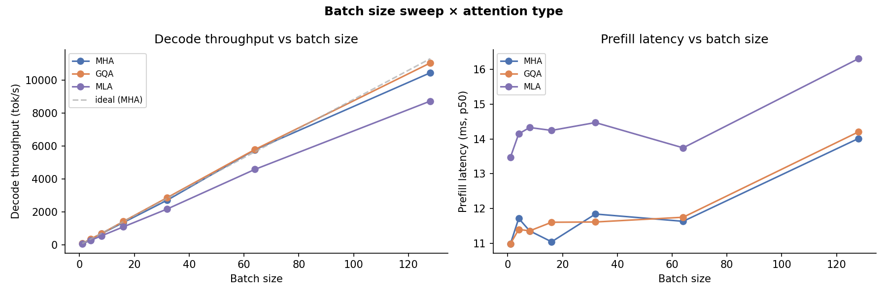

### Context Length

Latency and cache growth across prompt lengths 64 → 2048. The quadratic
attention cost is visible for all variants; MLA's cache slope is 5–10× flatter
than MHA.

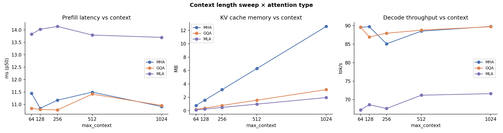

### Dtype

`float32` vs `bfloat16` latency and memory. `bfloat16` halves activation memory
and accelerates matrix operations, giving a consistent 30–50% latency reduction
without quality loss in practice.

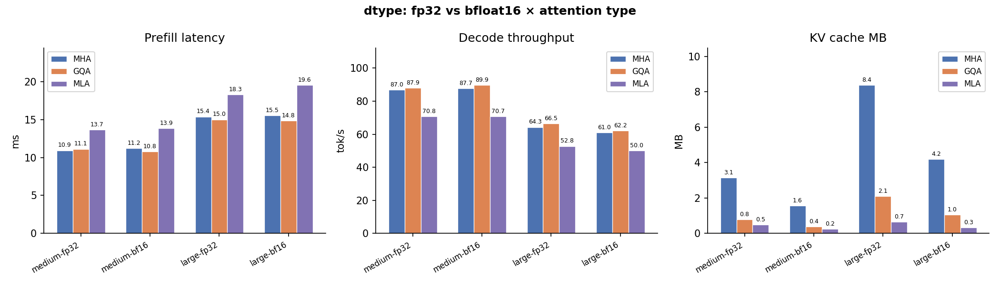

### KV Cache

Theoretical KV cache footprint (MB) per variant at different model sizes.
MLA's `down_dim_kv` dimension directly controls cache independent of model
width — the only variant where cache and model size are decoupled.

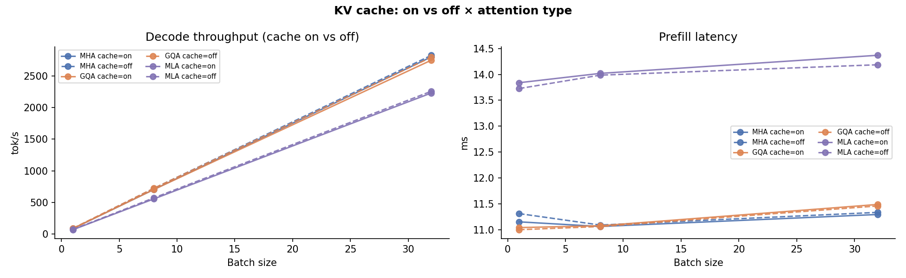

### MoE vs. Dense

Mixture-of-Experts (`use_moe=True`) vs. Dense FFN at matched parameter counts.
MoE adds routing overhead but keeps active FLOPs constant, making it
particularly attractive paired with MLA's compact cache.

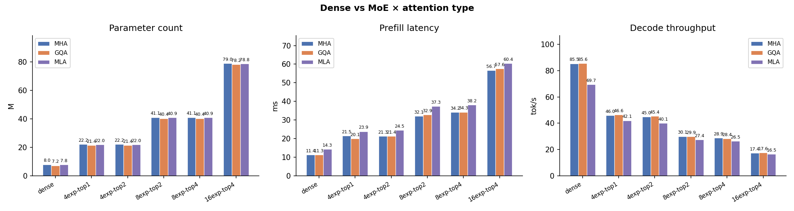

### Activation Function

SwiGLU vs. GELU latency. SwiGLU requires an extra gate projection but the
fused kernel keeps overhead minimal; the difference is negligible vs. attention
cost at long sequences.

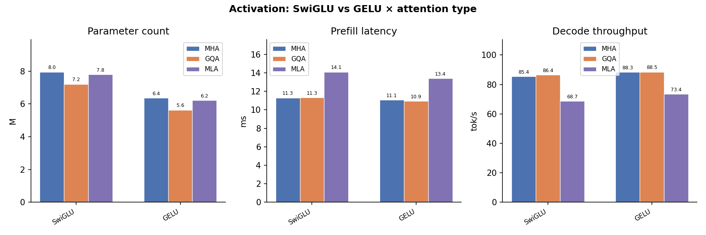

### Positional Encoding

RoPE vs. ALiBi vs. learned positional biases. RoPE adds negligible overhead;
ALiBi's per-head slope arithmetic is marginal at the sequence lengths tested.

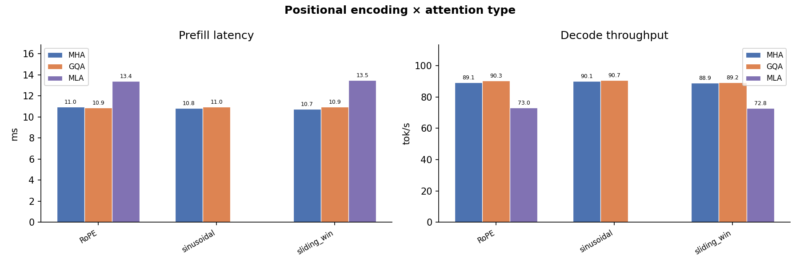

### GQA Heads vs. Cache

GQA key/value head count (`kv_heads`) sweep: `n_heads/8` → `n_heads`. Shows
the continuous cache–quality trade-off. At `kv_heads = n_heads` GQA degenerates
to MHA; MLA achieves lower cache at any GQA grouping ratio.

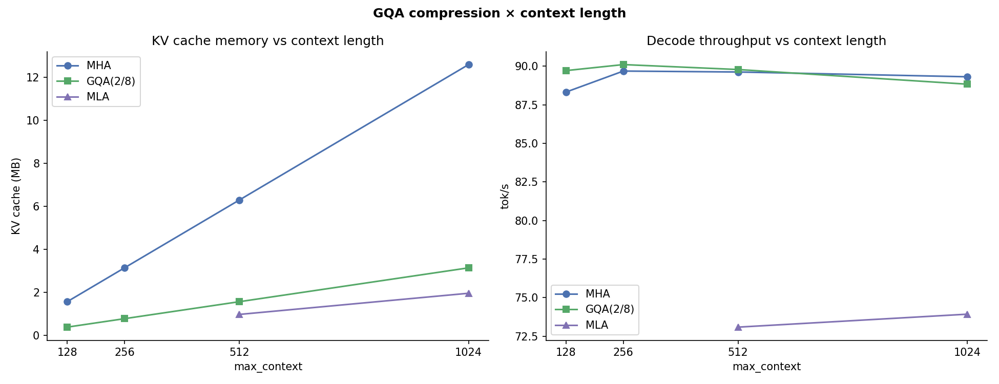

### Scale × Dtype

Joint effect of model scale and dtype on throughput. `bfloat16` advantage is
largest for big models where memory bandwidth is the dominant bottleneck.

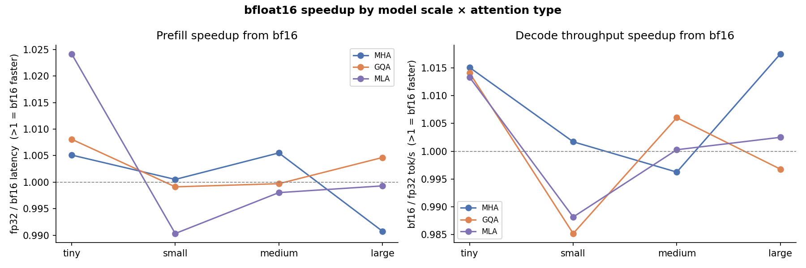

### Batch × Attention

Throughput heatmap over batch size × attention type. The crossover where MLA
starts matching or exceeding MHA/GQA throughput moves to smaller batch sizes
as model size grows.

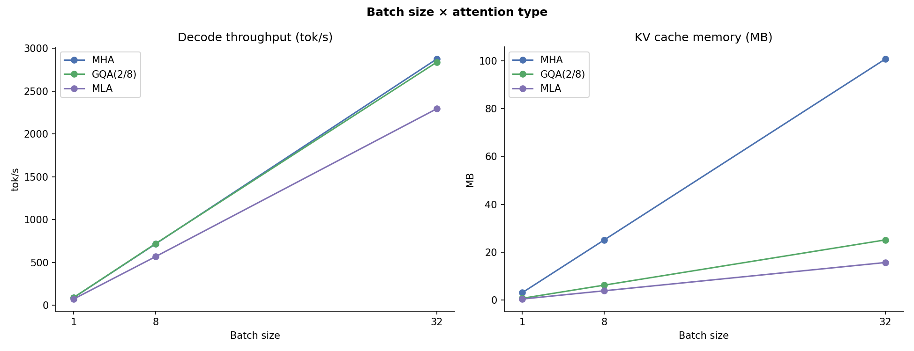

### Sampling Strategy

Greedy vs. top-k vs. top-p sampling latency. Sampling overhead is dominated
by the softmax and argmax operations, which are identical across attention
variants; per-step latency differences reflect pure attention cost.

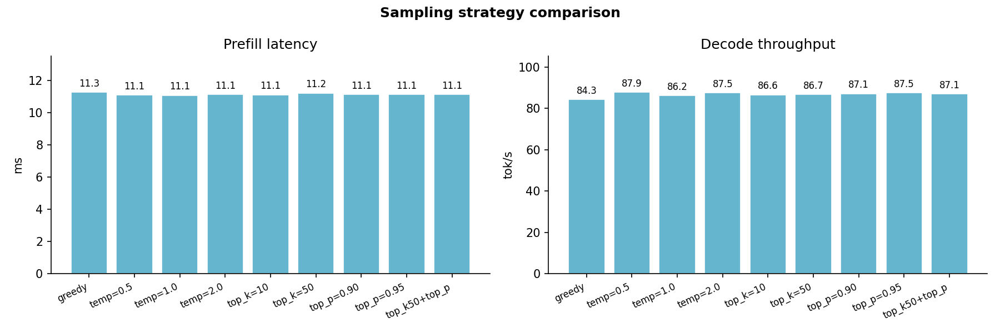

---

### 3D Relationships

Three-dimensional visualisations linking FLOPs, latency, throughput, batch
size, params, sequence length, and KV-cache across the three attention variants.

#### Params × Sequence → Latency

How prefill latency scales jointly with model parameters and sequence length.
The MLA surface sits highest because its extra projections add a constant
per-step cost on top of the quadratic attention term.

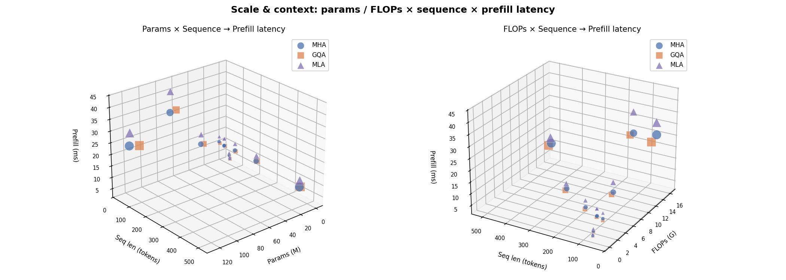

#### 2D Projections — Params × Seq → Latency

Pairwise scatter projections of the above 3D surface: Params vs. Latency,
Sequence vs. Latency, and Params vs. Sequence (size ∝ latency).

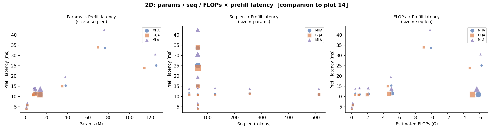

#### Batch × Seq → KV Cache

KV-cache footprint as a function of batch size and sequence length. MLA's
compressed cache keeps the surface an order of magnitude lower than MHA at
all (batch, seq) combinations.

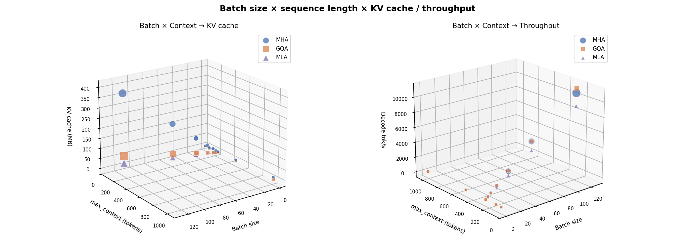

#### 2D Projections — Batch × Seq → KV Cache

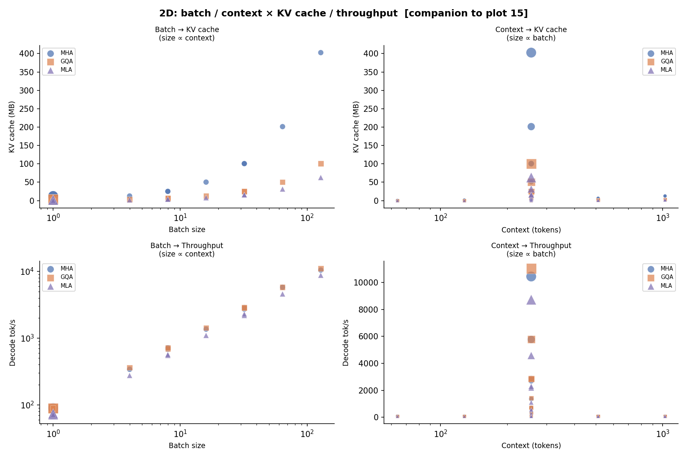

#### FLOPs × Latency → Throughput

Analytical FLOPs vs. measured latency coloured by throughput. MLA sits in the
high-FLOPs / low-latency quadrant at small sequences because XLA's JIT fuses
the low-rank projections efficiently; at long sequences the quadratic attention
cost dominates for all variants.

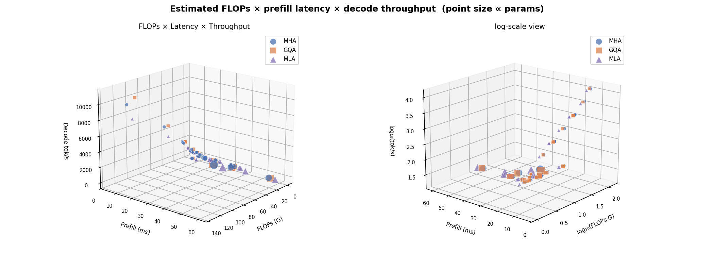

#### 2D Projections — FLOPs × Latency → Throughput

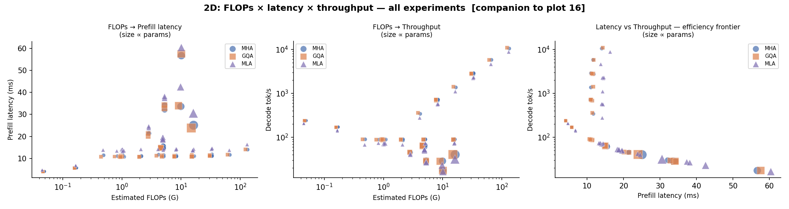

#### Params × Batch → Throughput

Aggregate throughput as a function of model scale and batch size. The
throughput gap between attention variants narrows as batch size grows because
memory bandwidth increasingly dominates over compute.

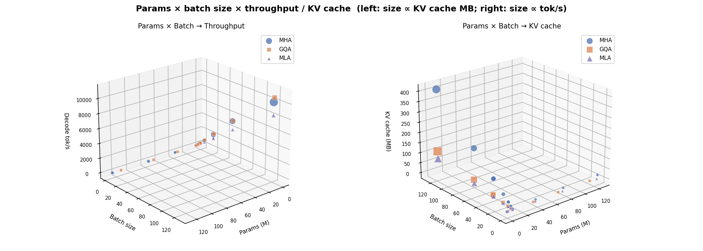

#### 2D Projections — Params × Batch → Throughput

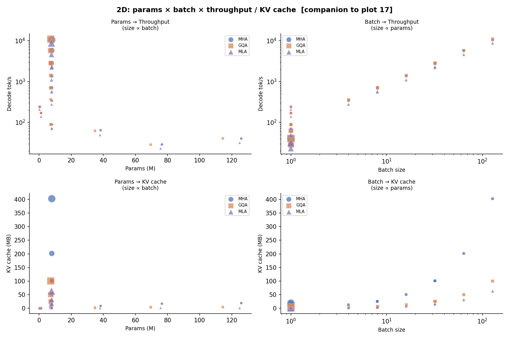

---

## Core Comparison

High-level trade-offs between attention types on real trained checkpoints:
quality vs. KV-cache Pareto front, VRAM-normalised serving throughput, and the
MLA `down_dim_kv` compression dial.

### Quality vs. KV-Cache Pareto

Scatter of validation loss vs. theoretical KV cache per token. Points on the
lower-left Pareto front dominate in both quality _and_ memory. MLA models
cluster on or near the front at a fraction of the cache cost of equivalent
MHA/GQA models.


### VRAM-Normalised Serving Throughput

Aggregate tokens/s as a function of total VRAM budget (500 MB – 80 GB).
Because MLA's smaller KV cache fits more concurrent sequences, it achieves
**3× the throughput of MHA** and ~20% more than GQA at 80 GB.


### MLA Compression Dial

Effect of `down_dim_kv` on quality and cache. Left: validation loss vs.
`down_dim_kv` with MHA/GQA reference bands. Right: cache MB vs. `down_dim_kv`
with crossover annotations. A value around 64–96 gives the best
quality/cache trade-off.


---

## Performance Analysis

Detailed throughput, FLOPs, and latency breakdowns on trained checkpoints.

### KV-Cache Size by Architecture

Absolute KV cache footprint (MB) vs. model params, grouped by depth
(`num_blocks`). MLA achieves a 5–10× cache reduction relative to MHA at the
same parameter count.


### Decode Throughput vs. Sequence Length

Tokens per second at context lengths 64 / 128 / 256 / 512. MHA/GQA advantage
at short sequences narrows as context grows.


### Analytical FLOPs vs. KV-Cache

Decode FLOPs per step vs. theoretical KV cache (Pareto view). MLA sits in the
high-FLOPs / low-cache quadrant because weight–weight products add ~9× extra
compute relative to MHA at bs=1, while shrinking cache 5–10×.


### Batch Throughput Sweep

Measured tokens/s across batch sizes 1 – 64 for representative 256-d and 512-d
models. The crossover point where MLA's smaller cache enables fitting more
sequences only becomes significant at 7B+ scale.


### Prefill Latency & Cache Extrapolation

Left: prefill latency vs. model parameters. Right: theoretical KV cache size
extrapolated from 512 to 128 k tokens — MLA's linear-but-low slope vs. MHA's
steep growth.


---

## 3D Cache Surfaces

Three-dimensional views of how KV cache, model quality, and throughput jointly
vary across architecture axes on trained checkpoints.

### KV-Cache vs. Params vs. Sequence Length

Separate surfaces for MHA, GQA, and MLA. Floor contours and VRAM-limit planes
(24 GB / 80 GB) highlight feasibility regions.


### Quality — Params — Cache Cube

3D scatter of validation loss × model parameters × KV cache (MB). The
Pareto-optimal cluster is dominated by MLA models.


### Efficiency Cube

Three axes all oriented higher-is-better: tokens/s × throughput-per-cache-MB ×
inverse validation loss. MLA models occupy the upper-right-front corner.


### VRAM Budget × Seq-Len Serving Surface

Aggregate serving throughput (k-tok/s) as a function of VRAM budget and
sequence length. The MLA surface consistently sits above MHA/GQA.


---

## down_dim_kv Deep Dive

MLA's key hyperparameter `down_dim_kv` controls the latent KV dimension.

### Cache vs. down_dim_kv vs. Sequence Length

MLA surface: `down_dim_kv` × seq-len → cache (GB). GQA and MHA appear as
horizontal reference planes at their fixed cache levels.


### KV-Dimension Decoupling

MHA/GQA have a steep dim-proportional cache slope; MLA is flat — its cache is
set by `down_dim_kv` independently of model width.


### MLA Quality Surface

Interpolated surface of validation loss over the (`down_dim_kv`, params) plane.
Quality plateaus above `down_dim_kv` ≈ 64.


### Cache vs. down_dim_kv vs. Depth

Four subplots at fixed sequence lengths (512 / 4 k / 32 k / 128 k tokens).
Deeper models hit the 80 GB wall at shorter contexts.


