# Benchmarks

Empirical comparison of **MHA**, **GQA**, and **MLA** attention families across memory footprint, KV cache size, throughput, and FLOPs. All runs use identical training budgets; MLA uses `inference=True` for decode benchmarks.

---

## Core Comparison

High-level trade-offs between attention types: quality vs. KV cache size (Pareto front), VRAM-normalised serving throughput, and the MLA `down_dim_kv` compression dial.

### Quality vs. KV-Cache Pareto

Scatter of validation loss vs. theoretical KV cache per token. Points on the lower-left Pareto front dominate in both quality _and_ memory. MLA models cluster on or near the front at a fraction of the cache cost of equivalent MHA/GQA models.

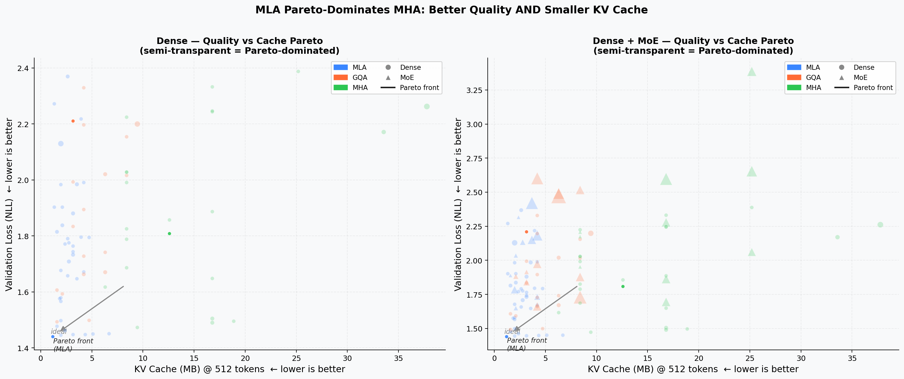

### VRAM-Normalised Serving Throughput

Aggregate tokens/s as a function of total VRAM budget (500 MB – 80 GB). Because MLA's smaller KV cache fits more concurrent sequences, it achieves **3× the throughput of MHA** and ~20% more than GQA at 80 GB.

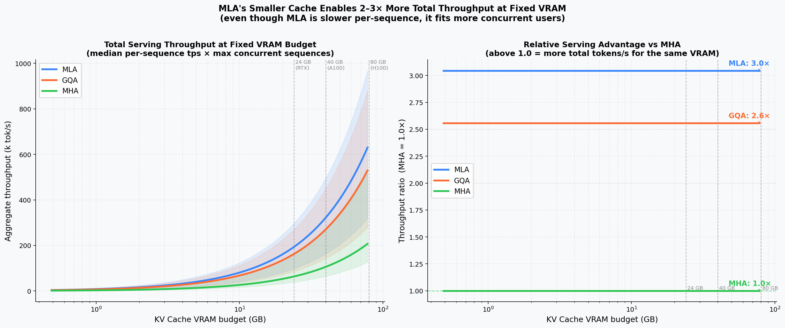

### MLA Compression Dial

Effect of `down_dim_kv` on quality and cache. Left: validation loss vs. `down_dim_kv` with MHA/GQA reference bands. Right: cache MB vs. `down_dim_kv` with crossover annotations. A value around 64–96 gives the best quality/cache trade-off.

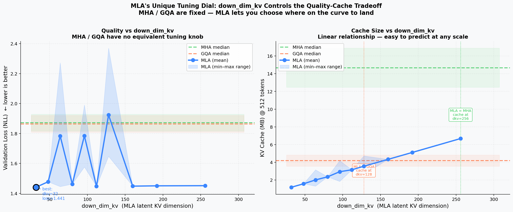

---

## Performance Analysis

Detailed throughput, FLOPs, and latency breakdowns across batch sizes and sequence lengths.

### KV-Cache Size by Architecture

Absolute KV cache footprint (MB) vs. model params, grouped by depth (`num_blocks`). Bar chart on the right shows median cache per type. MLA achieves a 5–10× cache reduction relative to MHA at the same parameter count.

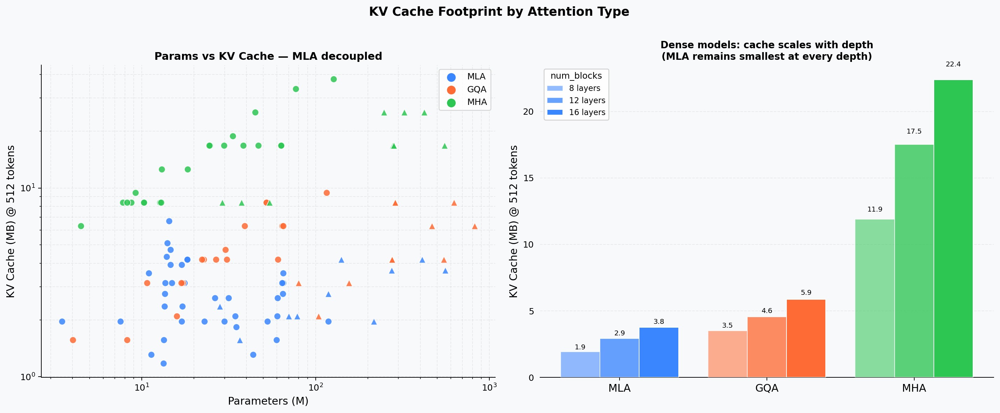

### Decode Throughput vs. Sequence Length

Tokens per second at context lengths 64 / 128 / 256 / 512. Left panel shows absolute throughput; right panel shows throughput normalised to MLA = 1.0 at each length. MHA/GQA advantage at short sequences narrows as context grows.

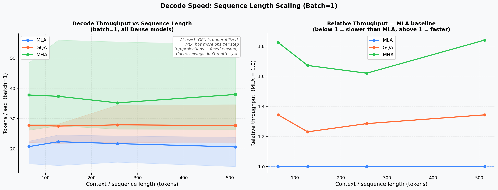

### Analytical FLOPs vs. KV-Cache

Decode FLOPs per step vs. theoretical KV cache (Pareto view). MLA sits in the high-FLOPs / low-cache quadrant because weight–weight products (`attn_proj`, `W_vo`) add ~9× extra compute relative to MHA at bs=1, while shrinking cache 5–10×.

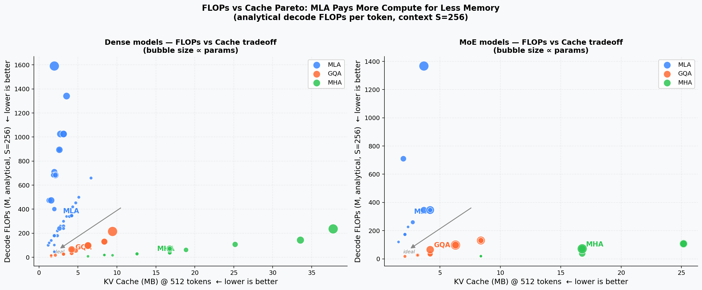

### Batch Throughput Sweep

Measured tokens/s across batch sizes 1 – 64 for representative 256-d and 512-d models. The crossover point where MLA's smaller cache enables fitting more sequences only becomes significant at 7B+ scale; these small models remain weight-bandwidth-bound.

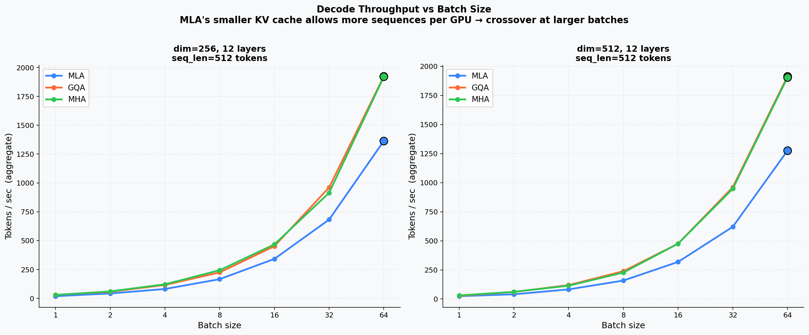

### Prefill Latency & Cache Extrapolation

Left: prefill latency vs. model parameters. Right: theoretical KV cache size extrapolated from 512 to 128 k tokens — MLA's linear-but-low slope vs. MHA's steep growth.

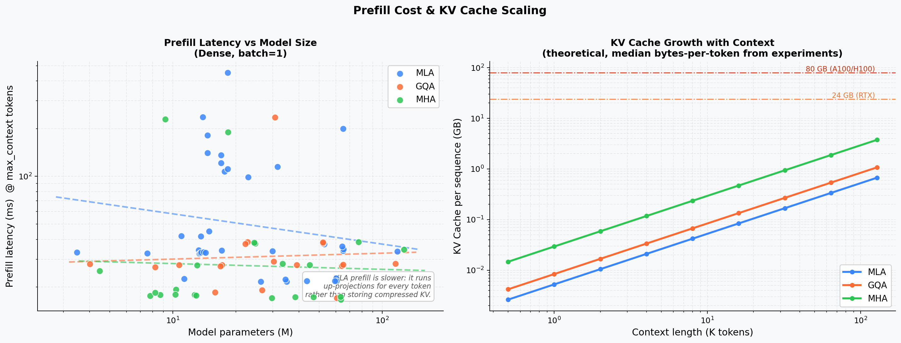

---

## 3D Cache Surfaces

Three-dimensional views of how KV cache, model quality, and throughput jointly vary across architecture axes.

### KV-Cache vs. Params vs. Sequence Length

Separate surfaces for MHA, GQA, and MLA showing how cache (GB) grows with params and context length. Floor contours and VRAM-limit planes (24 GB / 80 GB) highlight feasibility regions. MLA surface sits an order of magnitude below MHA at all points.

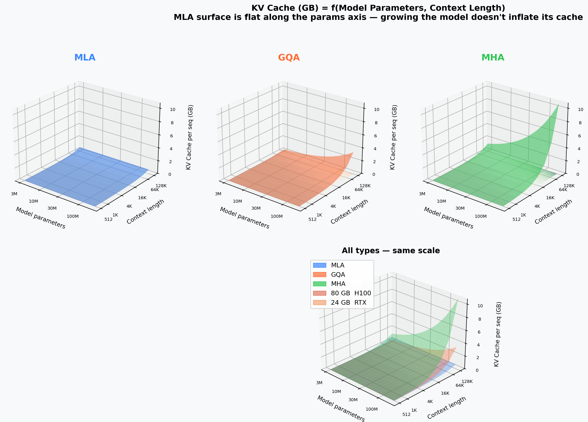

### Quality — Params — Cache Cube

3D scatter of validation loss × model parameters × KV cache (MB). Bubble colour encodes attention type. The Pareto-optimal cluster (low loss, small cache, moderate params) is dominated by MLA models.

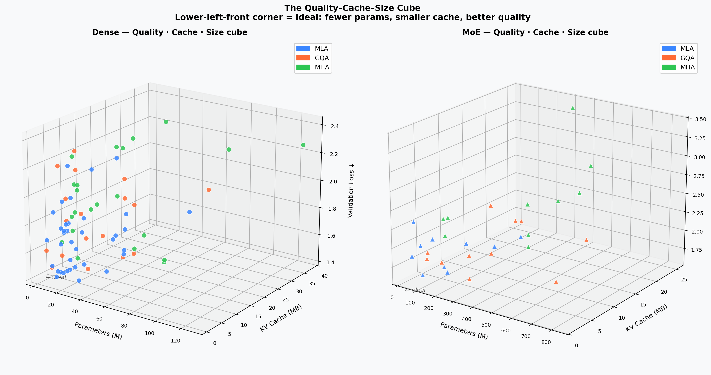

### Efficiency Cube

Three axes all oriented higher-is-better: tokens/s × throughput-per-cache-MB × inverse validation loss. Bubble size scales with model parameters. MLA models occupy the upper-right-front corner.

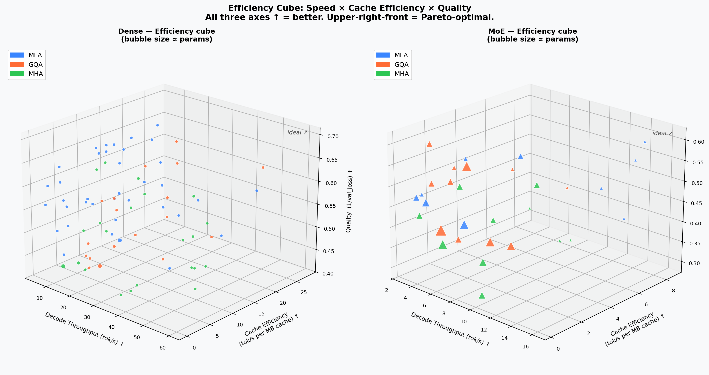

### VRAM Budget × Seq-Len Serving Surface

Aggregate serving throughput (k-tok/s) as a function of VRAM budget and sequence length. Vertical lines mark 24 GB and 80 GB GPU limits. The MLA surface consistently sits above MHA/GQA at all budget–length combinations.

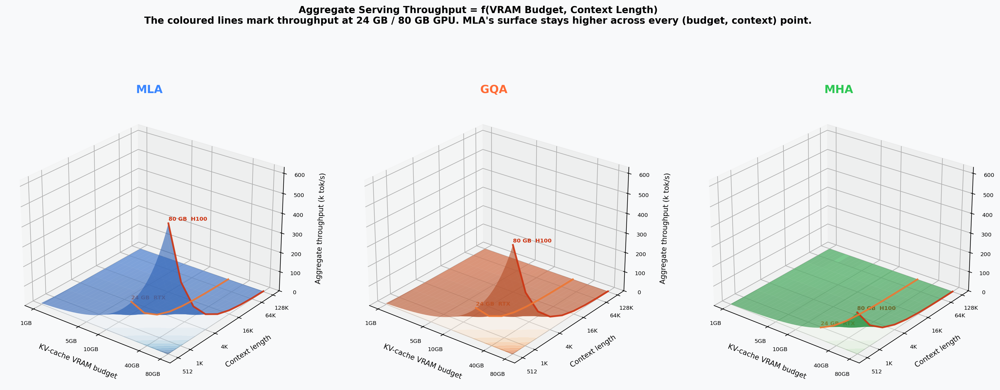

---

## down_dim_kv Deep Dive

MLA's key hyper-parameter `down_dim_kv` controls the latent KV dimension. These surfaces show exactly how it determines cache, quality, and the decoupling from model width.

### Cache vs. down_dim_kv vs. Sequence Length

MLA surface: `down_dim_kv` × seq-len → cache (GB). GQA and MHA appear as horizontal reference planes at their respective fixed cache levels. VRAM limit planes show feasibility at each GPU tier.

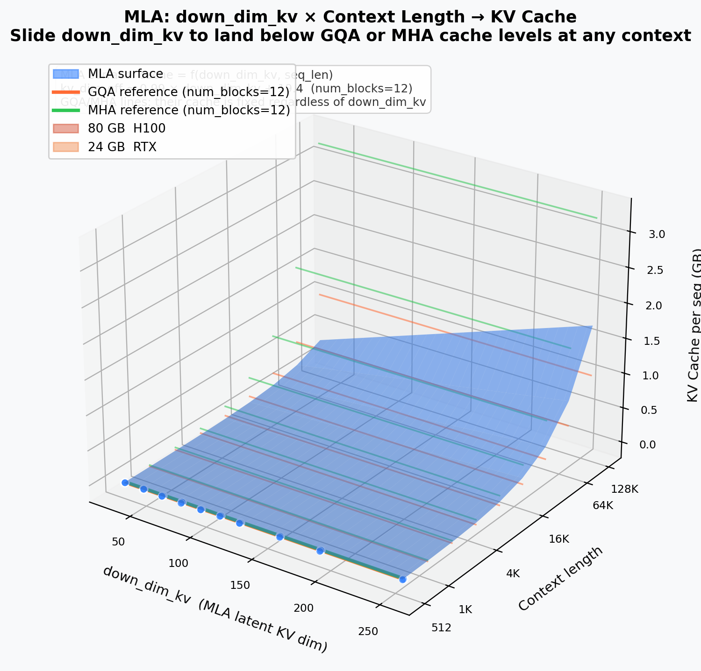

### KV-Dimension Decoupling

Left: 3D scatter of effective KV dimension (`kv_dim_eff`) × model params × cache. Right: 2D projection showing that MHA/GQA have a steep _dim_-proportional slope while MLA is flat — its cache is set by `down_dim_kv` independently of model width.

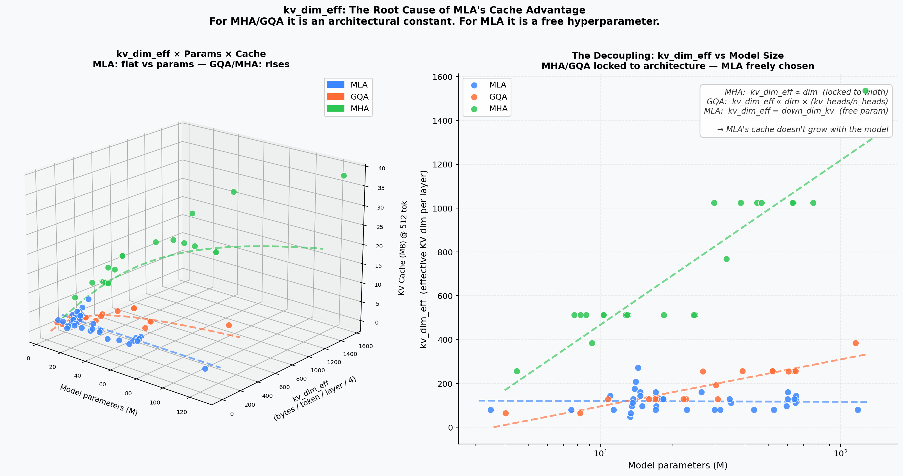

### MLA Quality Surface

Interpolated surface of validation loss over the (`down_dim_kv`, params) plane. MHA/GQA reference planes show their fixed-quality regions. Top-down heatmap with contours highlights the quality plateau above `down_dim_kv` ≈ 64.

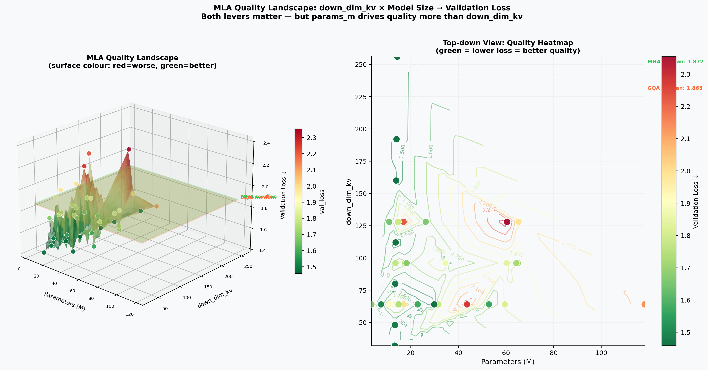

### Cache vs. down_dim_kv vs. Depth

Four subplots at fixed sequence lengths (512 / 4 k / 32 k / 128 k tokens). Each shows `down_dim_kv` × `num_blocks` → cache (GB) with floor projections and VRAM planes. Depth and `down_dim_kv` interact multiplicatively; deeper models hit the 80 GB wall at shorter contexts.

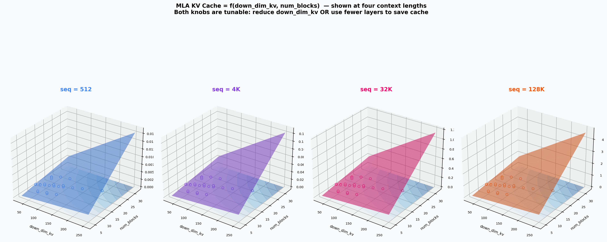
